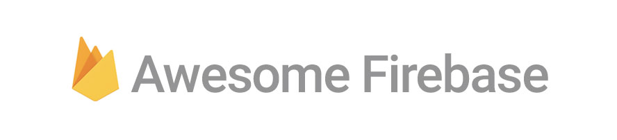

> A curated list of [firebase](https://firebase.google.com/).

## Table of Contents
* [SDK Documentation](#sdk-documentation)
* [Adapters](#adapters)
* [Helpers](#helpers)
* [Utilities](#utilities)
* [GUI Clients](#gui-clients)
* [Boilerplates and Starters](#boilerplates-and-starters)
* [Newsletter](#newsletter)
* [Videos](#videos)
* [Articles](#articles)
* [Featured Projects](#featured-projects)
* [Who to Follow](#who-to-follow)
* [Contributing](#contributing)
* [Licence](#licence)

## SDK Documentation
* [For iOS](https://firebase.google.com/docs/ios/setup)
* [For Android](https://firebase.google.com/docs/android/setup)
* [For Web](https://firebase.google.com/docs/web/setup)
* [For server](https://firebase.google.com/docs/server/setup)
* [API Reference](https://firebase.google.com/docs/reference/)

## Adapters
* [AngularFire](https://github.com/firebase/angularfire)	- The officially supported AngularJS binding for the Firebase Realtime Database and Authentication.
* [AngularFire2](https://github.com/angular/angularfire2) - The official library for Firebase and Angular 2.
* [PolymerFire](https://github.com/firebase/polymerfire)	- The officially supported Polymer bindings for the Firebase platform.
* [ReactFire](https://github.com/firebase/reactfire)	- The officially supported React binding for the Firebase Realtime Database.
* [Re-base](https://github.com/tylermcginnis/re-base)	- A Relay inspired library for building React.js + Firebase applications.
* [EmberFire](https://github.com/firebase/emberfire) - The officially supported Ember binding for the Firebase Realtime Database and Authentication.
* [BackboneFire](https://github.com/firebase/backbonefire)	- The officially supported Backbone binding for the Firebase Realtime Database.

## Helpers
* [FirebaseUI for IOS](https://github.com/firebase/FirebaseUI-iOS)	- An open-source library of UI components for various Firebase features.
* [FirebaseUI for Android](https://github.com/firebase/FirebaseUI-Android)	- An open-source library of UI components for various Firebase features.
* [GeoFire for IOS](https://github.com/firebase/geofire-objc) - An open-source library for the Firebase Realtime Database that adds support for geospatial querying.
* [GeoFire for Android](https://github.com/firebase/geofire-java) - An open-source library for the Firebase Realtime Database that adds support for geospatial querying.
* [GeoFire for WEB](https://github.com/firebase/geofire-js) - An open-source library for the Firebase Realtime Database that adds support for geospatial querying.
* [Firebase Queue](https://github.com/firebase/firebase-queue)	- A fault-tolerant, multi-worker, multi-stage job pipeline built on the Firebase Realtime Database in NodeJS.
* [firebase-util](https://github.com/firebase/firebase-util)	- A collection of experimental toys and utilities for use with the Firebase Realtime Database in JavaScript.
* [FirebaseJobDispatcher for Android](https://github.com/firebase/firebase-jobdispatcher-android)	- An open source library to help you schedule your one-time and periodic jobs easily on mobile devices.
* [FirebaseJobDispatcher for IOS](https://github.com/firebase/firebase-jobdispatcher-ios)	- An open source library to help you schedule your one-time and periodic jobs easily on mobile devices.
* [Firepad](https://github.com/firebase/firepad) - An open source library to add a shared editor to a web app.
* [Querybase](https://github.com/davideast/Querybase) - An open source library to add "where" statements to the JS SDK.

## Utilities
* [Firebase Import](https://github.com/firebase/firebase-import) -	A utility which helps import large JSON files into the Firebase Realtime Database.
* [Flashlight](https://github.com/firebase/flashlight) -	A pluggable integration with ElasticSearch to provide advanced content searches in the Firebase Realtime Database.
* [Firebase Admin](https://firebaseadmin.com/) - Admin User Interface for Firebase

## GUI Clients
* [Firebase Admin](https://firebaseadmin.com) -	A cross platform Firebase management tool with Graphical User Interface for Windows, Mac and Linux.

## Boilerplates and Starters
* [react-hot-redux-firebase-starter](https://github.com/douglascorrea/react-hot-redux-firebase-starter) - A Firebase 3.0 Starter for using React Redux it includes React Hot Loader 3.0.
* [react-firebase-authentication] (https://github.com/zerostatic/react-firebase-authentication) - Starter kit for authentication and real-time database using React and Firebase

## Newsletter
* [Best of Firebase](http://bestoffirebase.com/) - The free, monthly curated newsletter of the best Firebase news, articles, projects, and more.
* [Real Time Weekly](http://realtimeweekly.co/) - Weekly updates on the latest news in WebRTC and Real Time messaging for web and mobile applications.

## Videos
* Firebase channel
  * [Firebase youtube channel](https://www.youtube.com/user/Firebase/featured) - The official Youtube Channel for all things Firebase! Firebase has all the tools you need to build a successful app. It helps you reach new users, keep them engaged, scale up an infrastructure to meet that demand, in addition to earning money. Let Firebase handle these essentials while you spend more time building the app your users will love.
  * [Firecasts for Firebase Developers](https://www.youtube.com/playlist?list=PLl-K7zZEsYLnJVX_0zbKytptZGugPIbJR) - Firecasts is a hands on YouTube series for Firebase developers. Tune in each week and learn how to build realtime apps on Android, iOS, and the Web.
  * [Introducing Firebase](https://www.youtube.com/playlist?list=PLl-K7zZEsYLmOF_07IayrTntevxtbUxDL) - Firebase has all the tools you need to build a successful app. It helps you reach new users, keep them engaged, scale up an infrastructure to meet that demand, in addition to earning money. Let Firebase handle these essentials while you spend more time building the app your users will love.
* Google I/O 2016
  * [Firebase Overview](https://www.youtube.com/watch?v=tb2GZ3Bh4p8&list=PLl-K7zZEsYLlAyGS6_paVoGJ9YKC7J3NN&index=1) - Firebase just unveiled many significant and exciting new features. This session will give you an overview of what we’ve introduced and how you can use Firebase to build better apps and grow your business. James Tamplin and Francis Ma - product leads of Firebase, give you the full picture. After this session you’ll be equipped with the tools needed to build and grow the next great app!
  * [Migrate to Firebase](https://www.youtube.com/watch?v=RWM9J6Mvu-4&index=2&list=PLl-K7zZEsYLlAyGS6_paVoGJ9YKC7J3NN) - Firebase is easy to use, but it might not be your first Backend as a Service (BaaS). Learn how familiar concepts work in Firebase and how Firebase features can solve your existing problems in novel ways. For those considering using Firebase in a new project, we will explore an app written for both Firebase and Parse. For those considering using Firebase in an existing project, we will cover ways that Firebase can compliment or replace an existing backend.
  * [Angular 2 and Progressive Web Apps](https://www.youtube.com/watch?v=vAb-2d1vcg8&list=PLl-K7zZEsYLlAyGS6_paVoGJ9YKC7J3NN&index=4) - The Angular team has been investing in building tools and techniques that enable large teams to build robust applications that span desktop and mobile. Rob Wormald and Alex Rickabaugh cover the completely re-imagined Angular 2 framework, and the new tools that make it easy to build Progressive Web Apps.
  * [Use Firebase Analytics to Build Extraordinary Apps](https://www.youtube.com/watch?v=yi23CLNeGaw&index=5&list=PLl-K7zZEsYLlAyGS6_paVoGJ9YKC7J3NN) - The average smartphone user taps and swipes their way through 1GB of data each month. But how can you turn user behavior into meaningful insights that help you build a brilliant app? The answer is Firebase Analytics! In this session we explore the key metrics you need to know through the app lifecycle using real examples. From first release to a thriving user base, we show you how to detect user delight, user dissatisfaction and how to grow your app into a successful business.
  * [The key to Firebase security](https://www.youtube.com/watch?v=PUBnlbjZFAI&list=PLl-K7zZEsYLlAyGS6_paVoGJ9YKC7J3NN&index=6) - All data stored in Firebase is by default readable and writable by any authenticated user. While this is great for getting started, productions apps require stronger security. Thankfully, Firebase has your back with Security Rules. They provide a declarative way to specify who can access certain data and what schema that data should have. Take a deep dive into Firebase security to learn the best practices when securing your production Firebase apps.
  * [Grow your app with Firebase using Notifications, App Indexing, Dynamic Links](https://www.youtube.com/watch?v=v7T8ZAq7r1g&index=7&list=PLl-K7zZEsYLlAyGS6_paVoGJ9YKC7J3NN) - Are you looking to grow your app’s active user base? Growth is often a challenging and iterative process and in this talk we will go through the tools provided by Firebase to help you acquire users, retain them, and increase engagement. We go over Firebase App Indexing, Remote Config, Notifications, Invites, Dynamic Links, and AdWords and see how each of them can help you with growth in different ways. Following this, look for individual in-depth sessions for each of these.
  * [Deep Dive into the Realtime Database](https://www.youtube.com/watch?v=cYinms8LurA&index=8&list=PLl-K7zZEsYLlAyGS6_paVoGJ9YKC7J3NN) - Let the Firebase Realtime Database be your backend. Build your app faster, and sync your data in realtime. Come listen to David East speak how the Realtime Database is optimized for speed, security, and offline use. In this talk we'll take a look at how you can use the Realtime Database across Android, iOS, and the Web to build powerful realtime experiences.
  * [Google Cloud Messaging performance factors](https://www.youtube.com/watch?v=I-0y0BYPYvo&index=9&list=PLl-K7zZEsYLlAyGS6_paVoGJ9YKC7J3NN) - Explore factors affecting GCM performance while examining our real world performance statistics. We use these statistics to learn about real world user behavior.
  * [Increasing app quality with testing & monitoring](https://www.youtube.com/watch?v=4fyhgHQYG1U&index=10&list=PLl-K7zZEsYLlAyGS6_paVoGJ9YKC7J3NN) - Increasing the quality of your app is essential to growing and retaining your user base, increasing your customers’ satisfaction and boosting your revenues. Recent data from the Google Play Store revealed that the majority of users will never open an app again if they encounter two early-stage crashes. They are also more likely to give it a low rating and write a bad review. By mining the data from the 1-star reviews on Play, we recognized that more than half of these reviews are related to quality issues.
  * [Smarter sharing and onboarding with Firebase Dynamic Links and Firebase Invites ](https://www.youtube.com/watch?v=PmaUkTVywD8&index=11&list=PLl-K7zZEsYLlAyGS6_paVoGJ9YKC7J3NN) - URLs and mobile deep links are the foundation of online marketing channels, yet their behavior can change depending on the platform, how they were opened, and whether or not there's an app installed to handle the URL. Even more distressing, most deep link information gets lost during the app installation process. Firebase Dynamic Links are URLs that let you take the user to the best possible experience, no matter what their situation. In this talk, we look at how to use them. We also learn how Firebase Invites integrates Firebase Dynamic Links with a smart sender UI to make sharing more effective.
  * [Firebase SDK for Android: A tech deep dive](https://www.youtube.com/watch?v=AJqakuas_6g&index=12&list=PLl-K7zZEsYLlAyGS6_paVoGJ9YKC7J3NN) -
The best engineers know to seek confidence that the SDKs they put into their apps are fast, small, and reliable. In this session, we deep dive into Google SDKs for Android and take a look at how various parts of them are implemented. Warning! Once you watch, you'll be prepared to design and execute your own Android code-fu. Use this knowledge with extreme caution!
  * [Cross-Platform coding without a net](https://www.youtube.com/watch?v=7CWi_Olz0xw&index=13&list=PLl-K7zZEsYLlAyGS6_paVoGJ9YKC7J3NN) - Live-coding one app in front of several hundred attendees is dangerous. Live-coding two apps? Crazy. Trying to get them to talk to each other on the same shared backend and get it all working in half an hour? Well, that's moving into "keeping a pet wolverine" level of crazy. There will be thrills! There will be chills! There won't be any actual wolverines, though.
  * [What iOS Developers Should Know About the Firebase Platform](https://www.youtube.com/watch?v=L2LZKxdzY3g&index=14&list=PLl-K7zZEsYLlAyGS6_paVoGJ9YKC7J3NN) - Firebase! It's great. It's also cross-platform, which means we have a lot of interesting content that we want to share with just you iOS developers. Topics include everything from installation tips for iOS projects, how to make Remote Config happily work alongside NSLocalizedString, why how Firebase Cloud Messaging communicates with APNs, tips and tricks to keep your app svelte, and why APNs is spelled with a lower-case "s". Actually, we're just kidding about that last one. We have no idea.
  * [Notifications: Everything you need in 45 minutes](https://www.youtube.com/watch?v=KpTSpVh9SfY&list=PLl-K7zZEsYLlAyGS6_paVoGJ9YKC7J3NN&index=15) - Notifications are a powerful tool for engaging your end users. In this session, you'll learn about the life of a notification -- and the tools that you can use to create and deliver them, along with the APIs and best practices that you can use to render them in your apps. To know their effectiveness, you'll need to measure them too -- so we show you great tools and analytics that allow you to see which notifications work, and which ones don't.
  * [Firebase App Indexing: Rules of Engagement](https://www.youtube.com/watch?v=CwgWOHgHHJE&index=16&list=PLl-K7zZEsYLlAyGS6_paVoGJ9YKC7J3NN) - To-date Google has indexed over 100B deep links from Android and iOS apps. 40% of searches on Android return results for indexed apps as well. Learn the simple steps to get your mobile app indexed by Google to drive installs and traffic to your app. This talk shows you how your app content can appear in Google Search results, autocompletions when people search, and Now on Tap — as well as how you can test and measure your performance on Search.
  * [Firebase Fireside Chat](https://www.youtube.com/watch?v=DELEDwCy77w&index=17&list=PLl-K7zZEsYLlAyGS6_paVoGJ9YKC7J3NN) - Pull up a chair and join the Firebase team for a fireside chat. Learn a little bit more about why things work the way they do, from the people who built it. Don't miss this opportunity to get the inside story.
  * [Supercharging Firebase with Google Cloud Platform](https://www.youtube.com/watch?v=wOGfZ_aLGqM&index=18&list=PLl-K7zZEsYLlAyGS6_paVoGJ9YKC7J3NN) -
In this talk, we take a look at how you can use Firebase to build a real time application that interacts with virtual machines, big data, machine learning APIs, and more on Google Cloud Platform. Firebase allows you to build awesome real time apps quickly and easily. Google Cloud Platform lets you build powerful services that scale. Combining these two platforms gives you the power to build amazing experiences without worrying about infrastructure and operations. Join us as we show you step by step how we built our application in just a few days. You will walk away ready to build an amazing application with Firebase and Google Cloud Platform.
  * [GCM is now FCM (Firebase Cloud Messaging)](https://www.youtube.com/watch?v=VpbNFIY1qJ0&list=PLl-K7zZEsYLlAyGS6_paVoGJ9YKC7J3NN&index=19) - Firebase Cloud Messaging (FCM) is the new GCM! Find out what platforms it works on (more than Android!), new features, how simple development has become and how you can leverage the power of FCM to develop high quality apps!
  * [Earn more revenue from the AdMob platform](https://www.youtube.com/watch?v=Mpuf6gMTeY0&list=PLl-K7zZEsYLlAyGS6_paVoGJ9YKC7J3NN&index=20) - The AdMob platform provides effective ways to make more money from your app. AdMob is Google's leading app advertising solution, used by more than 650,000 Android and iOS apps. In this session aimed at beginners, you'll learn how to integrate AdMob ads, which come in a variety of formats to match your app's user experience perfectly. You'll discover how to request your first ad, and hear optimization tips to help you earn more.
  * [Recipes for App Development with Firebase](https://www.youtube.com/watch?v=BftyfmILbrM&list=PLl-K7zZEsYLlAyGS6_paVoGJ9YKC7J3NN&index=21) - Calling all mobile developers! Google's developer platform provide so many great tools for building your app. In this session, learn about how to use many of these components together to bring an app from idea to market to profit. We take a look at some potential app concepts and see how Google platforms can provide the infrastructure to make them successful. We can't wait to see what you build!
  * [Configuring the world: Rapid actioning based on analytic insights](https://www.youtube.com/watch?v=M6p9YOzB2GA&index=22&list=PLl-K7zZEsYLlAyGS6_paVoGJ9YKC7J3NN) - And now you're gaining fascinating insights on user behavior thanks to Analytics and you're itching to take action based on these insights. You can always go back to changing your app and pushing a new version, hoping your users will update your app. But there is a faster way to make changes: Firebase Remote Config.
  * [Zero to App: Develop with Firebase](https://www.youtube.com/watch?v=xAsvwy1-oxE&list=PLl-K7zZEsYLlAyGS6_paVoGJ9YKC7J3NN&index=23) - Firebase helps mobile and web developers create extraordinary apps. It abstracts complex infrastructure and simplifies the development process. By using Firebase, developers can build the best user experience in the shortest amount of time, all without having to spin up servers or manage infrastructure. We explore how Firebase authenticates users and synchronizes data by creating an app on stage. You'll experience first hand how easy it is to build with Firebase!
  * [Best practices for a great sign-in experience](https://www.youtube.com/watch?v=0ucjYG_JrEE&index=24&list=PLl-K7zZEsYLlAyGS6_paVoGJ9YKC7J3NN) - Are you losing users at sign-up or sign-in for your app? Google research has found that half of people get stuck on the sign-in screen. Building a secure and usable auth experience is difficult and time-consuming.
  * [Progressive Web Apps on Firebase](https://www.youtube.com/watch?v=SobXoh4rb58&list=PLl-K7zZEsYLlAyGS6_paVoGJ9YKC7J3NN&index=25) - Progressive Web Apps offer a first-class mobile experience for users, but can be daunting to approach the first time you build them. Luckily, Firebase offers a first-class development experience for building Progressive Web Apps! In this session, we take a Firebase-powered web application and turn it into an offline-ready, service-working, app-manifesting, production-ready Progressive Web App using Firebase Hosting, Auth, and Database. We walk through how to add Progressive Web App capabilities to an existing app, how to cache app shell and Firebase Database data offline, and how to deploy your PWA to Firebase Hosting.
  * [Improve User Acquisition Campaigns with Firebase Analytics](https://www.youtube.com/watch?v=tyPvJBVkhrI&list=PLl-K7zZEsYLlAyGS6_paVoGJ9YKC7J3NN&index=26) - Got a great app and want more users? Having a user acquisition strategy is crucial to global app domination, but it doesn't have to be a leap in the dark! This talk shines a light on how you can run both organic and paid app install campaigns to deliver real results in a cost-effective way -- and how Firebase Analytics ties it all together. You’ll learn how to track user acquisition performance, understand the right metrics to compare ad networks and see why lifetime value really matters.
  * [Creating interactive multiplayer experiences with Firebase](https://www.youtube.com/watch?v=8wF-mKMsynE&index=27&list=PLl-K7zZEsYLlAyGS6_paVoGJ9YKC7J3NN) - Building realtime features that work on all your different devices is the holy grail of app development. The Firebase Realtime Database lets you store and sync data instantly, and allows you to build a web, mobile or Unity application in minutes without worrying about wiring up a backend. The real time aspect and a number of lesser known, powerful features (such as transactions) make it possible to create a multiplayer gaming experience as well. In this session, you'll learn how to use the Firebase Realtime Database to keep track of your online players, synchronize game state across multiple connections, create chat rooms, and match players together for game play.
  * [Fireside Chat: Firebase in the Real World](https://www.youtube.com/watch?v=gdN4MMJEa8M&index=28&list=PLl-K7zZEsYLlAyGS6_paVoGJ9YKC7J3NN) - Developers face many challenges to establish a successful business. Firebase is Google's solution to help developers succeed! Join us for a discussion with developers across different sectors and regions to hear how they are using Firebase to develop, grow, and monetize their business.
  * [5 Neat Tricks You Can Do With The Firebase Platform](https://www.youtube.com/watch?v=5hYMDfDoHpI&list=PLl-K7zZEsYLlAyGS6_paVoGJ9YKC7J3NN&index=29) - So there's a lot of fun things you can already do with the new Firebase platform if you look at any individual feature. But let's take a look at some of the amazing tricks you can pull off when you combine some of these features together! Can you use the new Firebase platform to find your big spenders and send them a notification telling them about a hidden sale before the rest of your customer base? Well, I guess this presentation would be pretty boring if the answer was "no", but drop by and find out, anyway!
  * [Firebase for Games](https://www.youtube.com/watch?v=WiFgxtvpE1w&list=PLl-K7zZEsYLlAyGS6_paVoGJ9YKC7J3NN&index=30) - Many game developers face challenges beyond just making a fun client side experience. Developers target multiple platforms to capture a broad audience, build experiences to re-engage players, and continually use data to optimize game mechanics. Also, they need to keep the lights on. In this session, Stewart Miles presents how Firebase can be used as a tool to solve some of the common problems game developers face.
  * [Codeless Middleware: from paradox to reality](https://www.youtube.com/watch?v=7YIebVIRRN8&index=31&list=PLl-K7zZEsYLlAyGS6_paVoGJ9YKC7J3NN) - Google provides the ultimate toolkits for mobile developers. In this session we'll show you how build an application using the Google Maps Places API, and how to enable your users to make notes about any place in the world -- be it the places they've recently visited and enjoyed like restaurants or coffee shops, or just places that are personal to them -- like the house they grew up in. You'll come away equipped with the knowledge of how easy it is to build powerful middleware with little to no server coding, with a real app scenario that might be fun for you to build on!
  * [Angular 2](https://www.youtube.com/watch?v=EwYD_xqB7Qs&list=PLl-K7zZEsYLlAyGS6_paVoGJ9YKC7J3NN&index=32) - Early on with Angular 2, we focused on creating a full platform that encompasses even more of the needs of our developer community. Mobile is all the rage as of late, but the majority of successful product teams have investment across web, mobile web, installed mobile apps and even installed desktop applications. From individual developers all the way to CIOs, folks would like to reuse both their development expertise and their code across these platforms to deliver quickly and at minimal cost. Please watch to learn how we're addressing this full space of development needs in Angular 2.
  * [Create a great user experience with native ads](https://www.youtube.com/watch?v=ZlPRefDSrhk&list=PLl-K7zZEsYLlAyGS6_paVoGJ9YKC7J3NN&index=33) - With faster devices and more bandwidth come richer, more immersive ads. AdMob has cutting-edge formats which are high quality in appearance and load fast. In this advanced session, the AdMob team provides a deep dive into how the right ad technology helps you earn money and enhance user experience. Learn how AdMob's native ads can help you design user experiences that engage as well as they earn, plus how game publishers build audiences by integrating rewarded video formats into their game mechanics.
  * [Find 'em, Keep 'em: How ads get you the best app users](https://www.youtube.com/watch?v=Z9wLg6F0UqE&index=34&list=PLl-K7zZEsYLlAyGS6_paVoGJ9YKC7J3NN) - The AdMob platform provides effective ways to make more money from your app. AdMob is Google’s leading app advertising solution, used by more than 650,000 Android and iOS apps. In this session aimed at beginners, you’ll learn how to integrate AdMob ads via the Firebase SDK, which come in a variety of formats to match your app's user experience perfectly. You'll discover how to request your first ad, and hear optimization tips to help you earn more.
* PT-BR
  * [Firebase Adventures - PT-BR](https://www.youtube.com/watch?v=JoXaNHW6J1U) - O  Juarez (GDG Maceió) vai compartilhar com a gente sobre o Firebase.
  * [Firebase Papo Reto - PT-BR](https://www.youtube.com/watch?v=3tIpOl0lLKo) - O Firebase é uma plataforma para desenvolvimento de aplicativos baseados em armazenamento e sincronização de dados em tempo real utilizando apenas código client-side.

## Articles
* [How to CRUD data in Firebase using Ionic Framework](http://javebratt.com/crud-data-in-firebase/?utm_campaign=Best%2Bof%2BFirebase&utm_medium=web&utm_source=Best_of_Firebase_9) - See how to CRUD data in Firebase using Ionic Framework and the AngularFire library, it might seem intimidating at first, but it's actually too easy :)

## Featured Projects
* [Firebase Adventures](https://github.com/juarezpaf/firebase-adventures) - Firebase Adventures is a journey about how to use Firebase in different ways to give you the ability to build extraordinary cross-platform apps.

## Who to Follow
* Firebase [@Firebase](https://twitter.com/firebase)
* James Tamplin [@JamesTamplin](https://twitter.com/jamestamplin)
* Andrew Lee [@startupandrew](https://twitter.com/startupandrew)
* Michael McDonald [@asciimike](https://twitter.com/asciimike)
* Juarez Filho [@juarezpaf](https://twitter.com/juarezpaf)

## Contributing
Want to contribute? [Follow these recommendations](https://github.com/afonsopacifer/awesome-firebase/blob/master/CONTRIBUTING.md).

## License
[MIT License](https://github.com/afonsopacifer/awesome-firebase/blob/master/LICENSE.md) © [Afonso Pacifer](http://afonsopacifer.com/)
